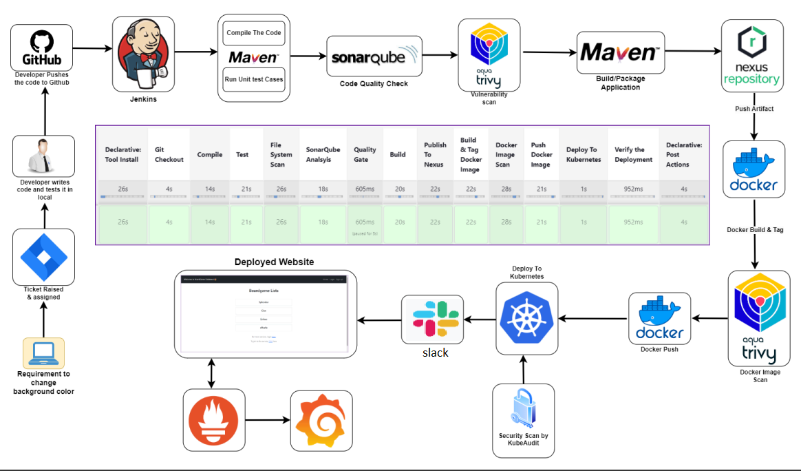

# DEPI DevOps project

**Distributed System Architecture with CI/CD Pipeline on AWS**


## Overview

This project demonstrates a hybrid architecture for deploying a distributed system using AWS, Kubernetes, and a CI/CD pipeline with Jenkins. It integrates various tools for application management, monitoring, and continuous delivery, ensuring scalability, reliability, and efficiency.

## Table of Contents

1. [Prerequisites](#prerequisites)
2. [Architecture](#architecture)
3. [Infrastructure Setup](#infrastructure-setup)
4. [Kubernetes Cluster Setup](#kubernetes-cluster-setup)
5. [CI/CD Pipeline with Jenkins](#cicd-pipeline-with-jenkins)
6. [Monitoring Setup](#monitoring-setup)
7. [License](#license)

## Prerequisites

- AWS account
- Terraform installed
- Jenkins installed
- Docker installed
- kubectl installed
- MobaXterm or SSH client for accessing EC2 instances
- Basic knowledge of AWS, Kubernetes, and CI/CD concepts

## Architecture

The architecture consists of:

- **Cloud Infrastructure**: 
  - AWS EC2 instances for Kubernetes Master and Worker nodes.
  - Monitoring instance for observability.
  
- **On-premises Components**: 
  - Jenkins for CI/CD processes.
  - Nexus for artifact management.
  - SonarQube for code quality analysis.

- **Monitoring Tools**: 
  - Prometheus for metrics collection.
  - Grafana for visualization of metrics.

## Infrastructure Setup

1. **Initialize Terraform**:
   - Navigate to the Terraform directory and run:
     ```bash
     terraform init
     ```

2. **Create Infrastructure**:
   - Apply the Terraform configuration to create the AWS resources:
     ```bash
     terraform apply
     ```

3. **Access EC2 Instances**:
   - Use MobaXterm to SSH into the instances using the generated key pair.

## Kubernetes Cluster Setup

1. **Install Docker**:
   - On each instance, run:
     ```bash
     sudo apt-get update
     sudo apt install docker.io -y
     sudo chmod 666 /var/run/docker.sock
     ```

2. **Install Kubernetes**:
   - Install the required dependencies and Kubernetes components:
     ```bash
     sudo apt-get install -y apt-transport-https ca-certificates curl gnupg
     curl -fsSL https://pkgs.k8s.io/core:/stable:/v1.28/deb/Release.key | sudo gpg --dearmor -o /etc/apt/keyrings/kubernetes-apt-keyring.gpg
     echo 'deb [signed-by=/etc/apt/keyrings/kubernetes-apt-keyring.gpg] https://pkgs.k8s.io/core:/stable:/v1.28/deb/ /' | sudo tee /etc/apt/sources.list.d/kubernetes.list
     sudo apt update
     sudo apt install -y kubeadm=1.28.1-1.1 kubelet=1.28.1-1.1 kubectl=1.28.1-1.1
     ```

3. **Initialize Kubernetes Master Node**:
   - On the Master node, run:
     ```bash
     sudo kubeadm init --pod-network-cidr=10.244.0.0/16 --ignore-preflight-errors=all
     ```

4. **Configure Cluster Access**:
   - Set up kubeconfig for the user:
     ```bash
     mkdir -p $HOME/.kube
     sudo cp -i /etc/kubernetes/admin.conf $HOME/.kube/config
     sudo chown $(id -u):$(id -g) $HOME/.kube/config
     ```

5. **Deploy Networking Solution**:
   - Deploy Calico for networking:
     ```bash
     kubectl apply -f https://docs.projectcalico.org/v3.20/manifests/calico.yaml
     ```

6. **Deploy Ingress Controller**:
   - Deploy NGINX Ingress Controller:
     ```bash
     kubectl apply -f https://raw.githubusercontent.com/kubernetes/ingress-nginx/controller-v0.49.0/deploy/static/provider/baremetal/deploy.yaml
     ```

## CI/CD Pipeline with Jenkins

1. **Jenkins Setup**:
   - Install necessary plugins:
     - Eclipse Temurin Installer
     - Pipeline Maven Integration
     - Config File Provider
     - SonarQube Scanner
     - Kubernetes CLI
     - Docker
     - Slack Notification

2. **Create a New Jenkins Pipeline**:
   - Use the following sample pipeline script:
     ```groovy
     pipeline {
         agent any
         tools {
             jdk 'jdk17'
             maven 'maven3'
         }
         environment {
             SCANNER_HOME = tool 'sonar-scanner'
             DOCKER_BUILDKIT = "1"
         }
         stages {
             stage('Git Checkout') {
                 steps {
                     git branch: 'main', credentialsId: 'project_git_token', url: 'https://github.com/your-repo.git'
                 }
             }
             // Add other stages for Compile, Test, SonarQube Analysis, Build, Publish, etc.
         }
     }
     ```

## Monitoring Setup

1. **Install Prometheus**:
   - Follow these commands:
     ```bash
     wget https://github.com/prometheus/prometheus/releases/download/v2.53.2/prometheus-2.53.2.linux-amd64.tar.gz
     tar -xvf prometheus-2.53.2.linux-amd64.tar.gz
     cd prometheus-2.53.2.linux-amd64/
     ./prometheus &
     ```

2. **Install Grafana**:
   - Run the following commands:
     ```bash
     sudo apt-get install -y adduser libfontconfig1 musl
     wget https://dl.grafana.com/enterprise/release/grafana-enterprise_11.2.2_amd64.deb
     sudo dpkg -i grafana-enterprise_11.2.2_amd64.deb
     sudo systemctl start grafana-server
     ```

3. **Configure Blackbox Exporter**:
   - Download and start Blackbox Exporter similarly as done with Prometheus.